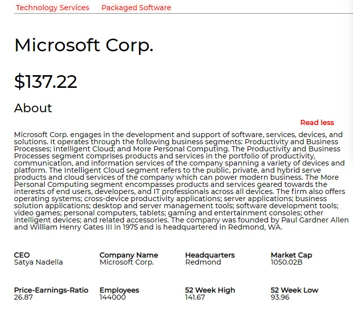
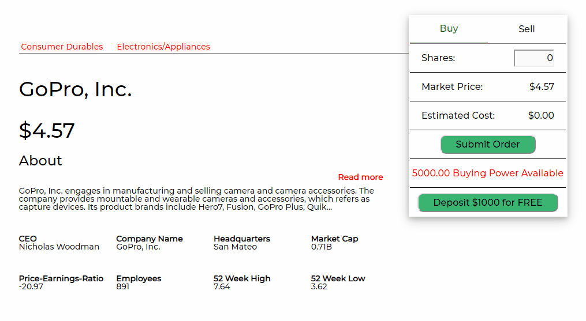
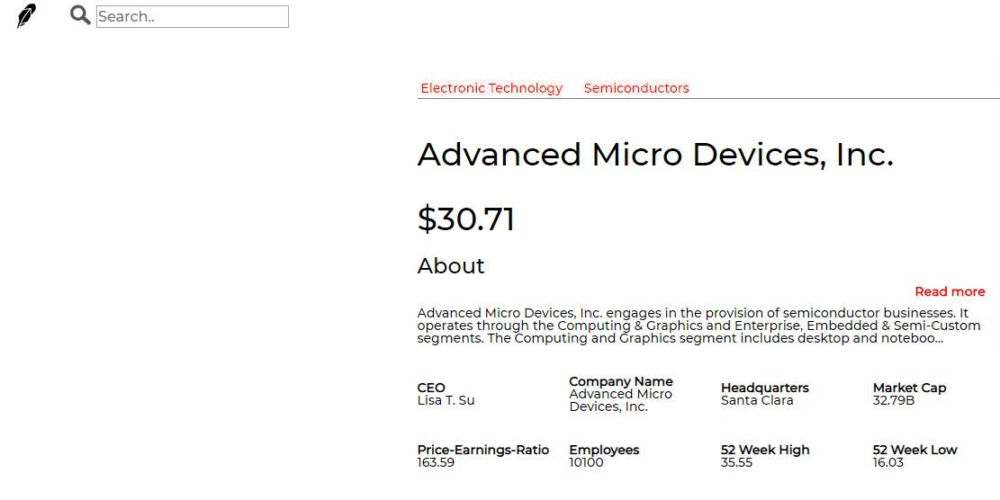

# Rock_on
A full-stack project. Clone of [Robinhood](https://robinhood.com/)

[Live Demo](https://rock-on-5566.herokuapp.com/)

## Technologies
* Backend: Rails/PostgreSQL
* Frontend: React/Redux
* [IEX API](https://iextrading.com/)
  

## Featrues
* Real stock data 
  
  

* Ability to purchase/sell stocks and update in real-time 
  

* Ability to search all available stocks with keyboard navigation 
  

* Css animation
  

## Code snippet example
```jsx
 stockInfo =
    <div className="stock-panel">
        <div className="panel-all-1 tags"><ul>{taglist}</ul></div>
        <h1 className="panel-all-2">
            <a href={website} className="hover-text-underline no-text-decoration">{companyName}</a><br/><br/>
            ${price}
        </h1>
        <h2 className="panel-all-3 about-h2">About</h2>
        <p className="panel-all-4">{this.state.lessDescription}
            <span id="dots">...</span>
            <span id="more">{this.state.moreDescription}</span>
        </p>
        <a onClick={this.toggleMoreLess} id="read-more-link" className="panel-all-3">Read more</a>
        <span className="cell-1-1"><span className="bold">CEO</span><br/>{CEO}</span>
        <span className="cell-1-2"><span className="bold">Company Name</span><br />{companyName}</span>
        <span className="cell-1-3"><span className="bold">Headquarters</span><br />{city}</span>   
        <span className="cell-1-4"><span className="bold">Market Cap</span><br />{handleBigNum(marketcap)}</span>   
        <span className="cell-2-1"><span className="bold">Price-Earnings-Ratio</span><br />{peRatio}</span>   
        <span className="cell-2-2"><span className="bold">Employees</span><br />{employees}</span>   
        <span className="cell-2-3"><span className="bold">52 Week High</span><br />{week52high}</span>   
        <span className="cell-2-4"><span className="bold">52 Week Low</span><br />{week52low}</span>
    </div>
```

The above code handles the main logic of displaying the stock infomation